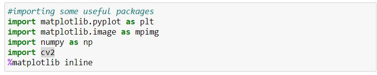

# Finding-Lane-Lines-on-the-Road

 
# **STEPS FOR** Finding Lane Lines on the Road** 

## **1 Importing Essential Libraries**

## **2  Read in an Image**
##

 

## **3 Ideas for Lane Detection Pipeline**
##

**Some OpenCV functions (beyond those introduced in the lesson) that might be useful for this project are:**

cv2.inRange() for color selection
cv2.fillPoly() for regions selection
cv2.line() to draw lines on an image given endpoints
cv2.addWeighted() to coadd / overlay two images cv2.cvtColor() to grayscale or change color cv2.imwrite() to output images to file
cv2.bitwise\_and() to apply a mask to an image

## **4 Helper Functions**
## **  

Below are some helper functions to help get you started. They should look familiar from the lesson!
## **5 Test Images**
##
Build your pipeline to work on the images in the directory "test\_images"

You should make sure your pipeline works well on these images before you try the videos.

## **	
##

## **6 Build a Lane Finding Pipeline**

Build the pipeline and run your solution on all test\_images. Make copies into the test\_images\_output directory, and you can use the images in your writeup report.

Try tuning the various parameters, especially the low and high Canny thresholds as well as the Hough lines parameters

## **7 Test on Videos**

You know what's cooler than drawing lanes over images? Drawing lanes over video!

We can test our solution on two provided videos:

solidWhiteRight.mp4

solidYellowLeft.mp4

**Note: if you get an import error when you run the next cell, try changing your kernel (select the Kernel menu above --> Change Kernel). Still have problems? Try relaunching Jupyter Notebook from the terminal prompt. Also, consult the forums for more troubleshooting tips.**

**If you get an error that looks like this:**

NeedDownloadError: Need ffmpeg exe. 

You can download it by calling: 

imageio.plugins.ffmpeg.download()

Let's try the one with the solid white lane on the right first ...

Play the video inline, or if you prefer find the video in your filesystem (should be in the same directory) and play it in your video player of choice.

# **** 
# **OUTPUT** 
** 

## **1 EXPECTED INPUT** 

## **2 EXPECTED OUTPUT** 

` `PAGE   \\* MERGEFORMAT 2

